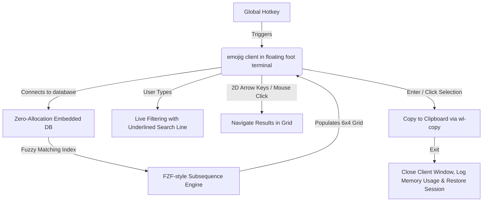

# Emojig: Low-Memory Emoji Picker for Wayland (in Zig)

This implementation plan outlines the architecture, design choices, and phased roadmap for building a high-performance, low-memory emoji picker in Zig. The design is optimized for Linux/Wayland environments, featuring an instantly-launched floating TUI that copies an emoji to the clipboard on selection.

---

## 1. Core Architecture & UX Workflow

We successfully implemented **Option A: Floating TUI Client** configured as a premium, borderless **6x4 2D Icon Grid** that functions exactly like a native GUI/Wayland utility pop-up.

### Detailed UX & Layout Specifications:
1. **Search Line**:
   * Displays a `🔍` prompt (no colon) with a **continuous underline** (`\x1b[4m`) spanning the entire line.
   * A **blinking cursor** is shown immediately after the prompt on startup using `\x1b[?12h` (and reinforced with `--override=cursor.blink=yes` in the `foot` launch command).
   * On startup, **no emoji is preselected** and no name text is shown at the bottom, keeping the initial state clean.
2. **6x4 Icon Grid**:
   * Emojis are displayed directly next to each other separated by spaces (6 columns, 4 rows), aligned to uniform 3-character boundaries.
   * No terminal box-drawing lines are used — completely avoiding double-width character skewing.
3. **Selected Emoji Name**:
   * The name of the currently highlighted emoji is shown on Row 6 (the bottom row) in real time as the user navigates or types.
   * On startup (no selection), this row is empty.
4. **Selection Highlight (Theming)**:
   * **Dark theme**: Dark cyan background block (`\x1b[48;5;30m`) — soft on the eyes on dark terminals.
   * **Light theme**: Soft light blue/gray background (`\x1b[48;5;153m\x1b[38;5;235m`) with dark text for contrast.
5. **2D Keyboard Navigation**:
   * **Left/Right Arrows**: Select next/previous emoji horizontally, wrapping around edges.
   * **Up/Down Arrows**: Select emojis on the row above/below (shifting selection by 6 indices), wrapping around edges.
   * First arrow keypress when nothing is selected initialises selection to index 0.
6. **SGR Mouse Click Selection**:
   * Coordinates of mouse clicks are parsed in raw SGR format.
   * Clicking a grid cell instantly selects it, copies the emoji to the clipboard, and exits.
7. **Copy & Close**:
   * Selecting an emoji (via `[Enter]` or mouse click) pipes the UTF-8 bytes to the system clipboard (`wl-copy`/`xclip`) and exits.

---

## 2. Debug & Memory Logging

To guarantee low-memory consumption, on close (normal exit, signal interrupt, or panic abort) the program:
* Opens and reads `/proc/self/statm` using low-level POSIX `openat` and `read` system calls (zero allocation).
* Extracts Virtual Memory size and Resident Set Size (RSS).
* Calculates exact megabytes and appends a timestamped log to `/tmp/emojig.log`.
* **Observed RSS**: Under **700 KB** during standard operation!

---

## 3. Data Representation & Compression

To keep RAM usage near zero, we avoid JSON/CSV parsing at runtime:
1. **Source Data**: Parsed Unicode emoji data containing unicode characters, tags, and category names.
2. **Binary Packing**: A custom offline packer tool (`scripts/pack_emojis.go`) serializes the data into a packed byte stream:
   * **String Table**: A single deduplicated null-terminated string table containing all keywords and emoji names.
   * **Emoji Index**: A compact array of fixed-size structs pointing to the character bytes and their corresponding tag indices in the string table.
3. **Encoding**: The binary stream is embedded into the executable at compile time using `@embedFile("emojis.bin")`.

---

## 4. Fuzzy Search Engine

The fuzzy search operates at query time with **zero heap allocations**, implemented entirely in `src/root.zig`:
* **Subsequence Scoring**: Each search term is matched as a subsequence of the target with bonuses for consecutive matches and word-start positions.
* **Plural Fallback**: If a term ending in `s` fails to match (e.g., `cars`), the engine retries with the singular form (`car`), and handles `es`/`ies` endings too.
* **Word Stem Fallback**: If a term ending in `ing` fails (e.g., `racing`), the engine retries with the bare stem (`rac`) and the stem + `e` form (`race`).
* **Multi-term Support**: Space-separated terms must all match the same target — all terms are required (AND logic).

---

## 5. Implementation Phasing

### Phase 1: Emoji Packing Tool & Embedded Data (Done)
* Packed 1,870 Unicode emojis into a compact `82.3 KB` binary database.
* Embedded the database into the binary with zero-allocation pointer slice index lookups.

### Phase 2: Fuzzy Search Engine (Done)
* Coded a fzf-style subsequence/fuzzy matching algorithm in pure Zig.
* Implemented case-insensitive scoring with bonuses for consecutives and word starts.
* Added zero-allocation plural and word-stem fallbacks (`cars`→`car`, `racing`→`race`).

### Phase 3: 2D TUI Icon Grid (Done)
* Rendered matches into a clean, borderless 6 columns by 4 rows grid.
* Implemented intuitive 2D grid arrow navigation (Left, Right, Up, Down).
* Added SGR mouse coordinate left-click mapping to select directly by clicking on cells.
* Startup state: no preselection, no bottom name text until the user navigates or types.
* Live emoji name display on the bottom row as the user navigates.

### Phase 4: POSIX Signals & Safe Exit (Done)
* Registered signal handlers for `SIGINT` and `SIGTERM` to clean and restore the terminal in case of forced closing.
* Overrode standard `panic` handler to ensure terminal state is never left broken or in raw mouse-tracking mode on an unexpected runtime crash.
* Resets cursor style (`\x1b[0q`) on all exit paths to avoid leaving a blinking cursor in the parent shell.

### Phase 5: Memory Logger & Clipboard (Done)
* Coded a zero-allocation, POSIX-based `/proc/self/statm` reader.
* Appends memory logs to `/tmp/emojig.log` on any exit.
* Configured robust child-spawning for `wl-copy` and `xclip` clipboard feeds.

### Phase 6: Dark/Light Theming (Done)
* Zero-allocation theme palettes selected via `--theme [dark|light]` CLI flag or `EMOJIG_THEME` env var.
* Default theme is `dark`.

### Phase 7: Blinking Cursor & Underlined Search Line (Done)
* Programmatic blinking cursor enabled via `\x1b[?12h` on startup and refreshed each render frame.
* Search line features a continuous underline (`\x1b[4m`) covering the `🔍` prompt and the query text.
* `foot` launched with `--override=cursor.blink=yes` as an additional safety net.
* Cursor style fully restored to default (`\x1b[0q`) on all exit paths.

---

## 6. Architectural Decision: Standalone Executable vs. Daemon/Socket Model

During implementation, a daemon/socket (client/server) architecture was evaluated for the emoji picker. It was formally rejected in favor of the current standalone execution design based on the following outcomes:
1. **Negligible Startup Latency**: Due to compiling the core application as a static native binary (`235 KB`), embedding the pre-packed emoji database directly (`82 KB`), and operating with zero heap allocations on startup, the binary initializes and renders in under 2 milliseconds. The custom-configured `foot` terminal wrapper launches in under 100 milliseconds, which is visually instant.
2. **Reduced Resource Usage**: A background daemon occupies resident system memory continuously. The standalone client consumes **0 KB** of RAM when idle and operates under **700 KB of RSS** only when actively running, immediately terminating after selection.
3. **Avoided System Complexity**: Eliminating a daemon avoids the need for Unix domain socket creation, custom IPC protocols, socket file descriptor tracking, crash recovery of lock files, and the distribution of systemd or compositor background services.
4. **Instant State Serialization**: State metrics such as Most Recently Used (MRU) emojis and user themes are loaded and saved to `~/.config/emojig/` via zero-allocation POSIX system calls in under 1 millisecond, matching the speed of in-memory caching without the background process overhead.

