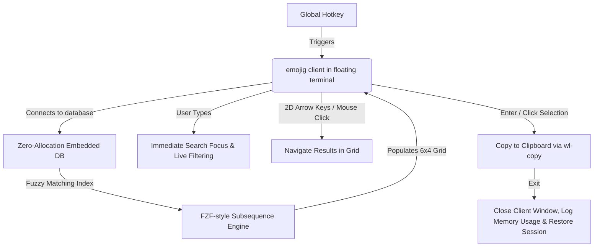

# Emojig: Low-Memory Emoji Picker for Wayland (in Zig)

This implementation plan outlines the architecture, design choices, and phased roadmap for building a high-performance, low-memory emoji picker in Zig. The design is optimized for Linux/Wayland environments, featuring a background daemon for hot-caching and instant launch times.

---

## 1. Core Architecture & UX Workflow

We successfully implemented **Option A: Floating TUI Client** configured as a premium, borderless **6x4 2D Icon Grid** that functions exactly like a native GUI/Wayland utility pop-up.

### Detailed UX & Layout Specifications:
1. **Interactive Borderless Layout**:
   * **Search Box on Top**: Instantly captures keyboard input for real-time subsequence search filtering.
   * **6x4 Icon Grid**: Emojis are displayed directly next to each other separated by space (6 columns, 4 rows), aligned to uniform 3-character boundaries. No terminal box-drawing lines are used, completely avoiding double-width character skewing!
2. **Dark Cyan Selection Highlight**:
   * The currently highlighted emoji is wrapped inside the POSIX `\x1b[48;5;30m` (dark cyan background) character block. This draws a clean, neutral dark cyan background block behind the emoji, which is soft on the eyes and contrasts well on both light and dark terminals (including custom dark backgrounds like Tilix).
3. **2D Keyboard Navigation**:
   * **Left/Right Arrows**: Select next/previous emoji horizontally, wrapping around edges.
   * **Up/Down Arrows**: Select emojis on the row above/below (shifting selection by 6 indices), wrapping around edges.
4. **SGR Mouse Click Selection**:
   * Coordinates of mouse clicks are parsed in raw SGR format.
   * Clicking a grid cell (`click_col / 3`) instantly highlights it, copies the emoji to the clipboard, and exits.
5. **Copy & Close**:
   * Selecting an emoji (via `[Enter]` or mouse click) pipes the UTF-8 bytes to the system clipboard (`wl-copy`/`xclip`) and exits.

---

## 2. Debug & Memory Logging

To guarantee low-memory consumption, on close (normal exit, signal interrupt, or panic abort) the program:
* Opens and reads `/proc/self/statm` using low-level POSIX `openat` and `read` system calls (zero allocation).
* Extracts Virtual Memory size and Resident Set Size (RSS).
* Calculates exact megabytes and appends a timestamped log to `/tmp/emojig.log`.
* **Observed RSS**: Under **700 KB** during standard operation!

---

## 3. Data Representation & Compression

To keep RAM usage near zero, we avoid JSON/CSV parsing at runtime:
1. **Source Data**: Parsed Unicode emoji data containing unicode characters, tags, and category names.
2. **Binary Packing**: We build a custom offline packer tool that serializes the data into a packed byte stream:
   * **String Table**: A single deduplicated null-terminated string containing all keywords and emoji names.
   * **Emoji Index**: A compact array of fixed-size structs pointing to the character bytes and their corresponding tag indices in the string table.
3. **Encoding**: We embed this binary stream into the executable using `@embedFile`.

---

## 4. Implementation Phasing

### Phase 1: Emoji Packing Tool & Embedded Data (Done)
* Packed 1,870 Unicode emojis into a compact `82.3 KB` binary database.
* Embedded the database into the binary with zero-allocation pointer slice index lookups.

### Phase 2: Fuzzy Search Engine (Done)
* Coded a fzf-style subsequence/fuzzy matching algorithm in pure Zig.
* Implemented case-insensitive scoring with bonuses for consecutives and word starts.

### Phase 3: 2D TUI Icon Grid (Done)
* Rendered matches into a clean, borderless 6 columns by 4 rows grid.
* Implemented intuitive 2D grid arrow navigation (Left, Right, Up, Down).
* Added SGR mouse coordinate left-click mapping to select directly by clicking on cells.

### Phase 4: POSIX Signals & Safe Exit (Done)
* Registered signal handlers for `SIGINT` and `SIGTERM` to clean and restore the terminal in case of forced closing.
* Overrode standard `panic` handler to ensure terminal state is never left broken or in raw mouse-tracking mode on an unexpected runtime crash.

### Phase 5: Memory Logger & Clipboard (Done)
* Coded a zero-allocation, POSIX-based `/proc/self/statm` reader.
* Appends memory logs to `/tmp/emojig.log` on any exit.
* Configured robust child-spawning for `wl-copy` and `xclip` clipboard feeds.
