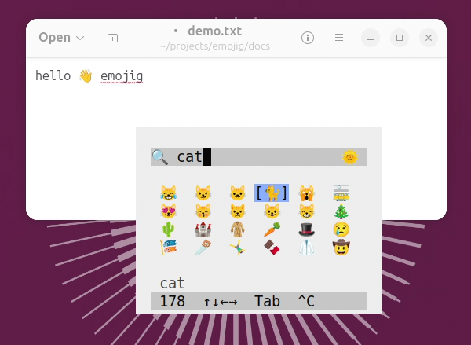
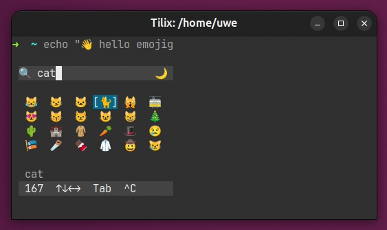

# emojig - *all your emoji are belong to us!*

Emojig is your zig-based, low-memory, instant-popup, terminal-based, daemon-free GUI+TUI emoji picker on all your Linux systems.

**Website:** https://ubunatic.com/emojig





## Features
**🏎️** Fast and low-memory (340 KB static binary, < 2.0 MB RAM) \
**😀** Works in the terminal and as a floating desktop window \
**🔍** Fuzzy search across 1,870 emojis \
**↔️** Navigate with arrow keys or mouse \
**📋** Sends the emoji to your clipboard or shell prompt

## Install

> [!Important]
> GUI mode is Wayland-only for now and requires `foot` and `wl-copy`.
> Install with `brew`, `cargo`, `apt`, or a package manager of your choice.

To download the latest static binary and install it:

```sh
curl -fsSL https://ubunatic.com/emojig/install.sh | sh
```

`--install` copies the binary to `~/.local/bin/emojig` and writes shell integration
scripts to `~/.local/share/emojig/shell/`.

### Fonts

emojig only uses standard Unicode emoji — no Nerd Fonts or special symbols needed.
If emojis appear as boxes, install a color emoji font:

```sh
sudo apt install fonts-noto-color-emoji      # Debian / Ubuntu / Mint
sudo pacman -S noto-fonts-emoji              # Arch / Manjaro
sudo dnf install google-noto-emoji-color-fonts  # Fedora
sudo zypper install noto-coloremoji-fonts    # openSUSE
```

## The TUI-GUI
The *GUI* mode currently requires the [`foot`](https://codeberg.org/dnkl/foot) terminal to serve the emoji *TUI* in a borderless window.

I chose `foot` since it lauches instantly, uses minimal resources, and has all the features needed for a great TUI.

**💻**  Bind a desktop key to run `emojig --gui` \
`>_`  Run `emojig --tui` inline in the terminal \
✨  Or just `emojig` — it picks GUI or inline TUI automatically

## Shell integration (Ctrl+E)

Add one line to your shell rc file:

```sh
# zsh — ~/.zshrc
source ~/.local/share/emojig/shell/emojig.zsh
```

```sh
# bash — ~/.bashrc
source ~/.local/share/emojig/shell/emojig.bash
```

```sh
# fish — ~/.config/fish/config.fish
source ~/.local/share/emojig/shell/emojig.fish
```

Then reload your shell and press **Ctrl+E** at any prompt — the picker opens inline,
pick an emoji, it lands at your cursor. Also copies to clipboard if available.

To use a different key: `export EMOJIG_KEY='^F'` (zsh/bash format) before sourcing.

## Usage

```sh
emojig                  # auto: floating window (GUI) or inline TUI (terminal)
emojig --tui            # force inline TUI — works over SSH, in VT, anywhere
emojig --gui            # force floating foot window (Wayland/X11)
emojig --install        # install binary + shell scripts to ~/.local/
$(emojig)               # stdout capture — emoji goes to the calling shell
emojig | wl-copy        # pipe to clipboard tool directly
```

## Controls

| Key | Action |
|-----|--------|
| Type | Fuzzy filter |
| Arrow keys | Navigate grid (2D) |
| Enter | Confirm selection |
| Mouse click | Select and confirm |
| Tab | Cycle theme (dark / light / system) |
| Escape, Ctrl+C | Cancel |

Plural and stem fallbacks apply: `cars` → `car`, `racing` → `race`.

## Output

| Context | Behaviour |
|---------|-----------|
| Standalone at prompt | Copy to clipboard (`wl-copy` / `xclip`) |
| Shell widget / `$(emojig)` | Print to stdout + try clipboard |
| `emojig \| cmd` | Pipe to `cmd` |

## Theming

Dark, light, and system (auto-detected via OSC 11) themes. Tab-toggle in the TUI
saves your choice to `~/.config/emojig/config`. Override with `--theme` or
`EMOJIG_THEME`.

## Requirements

- Linux (x86\_64 or aarch64)
- **GUI mode** (`--gui`): `foot` terminal + Wayland or X11 session
- **Clipboard**: `wl-copy` (Wayland) or `xclip` (X11) — optional

## Performance

- Binary: **340 KB** (static, no runtime deps)
- RAM: **< 2.0 MB RSS** during operation, 0 when idle (excl. launcher/foot memory usage, which adds ~16 MB for foot)
- Database: 1,870 emojis embedded at compile time — no data files

## License

AGPL-3.0-or-later. See [LICENSES/](LICENSES/).
