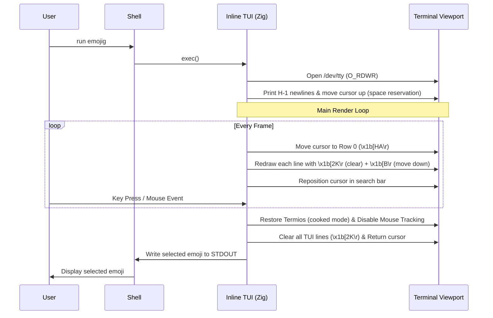

<!--
SPDX-FileCopyrightText: 2026 Uwe Jugel
SPDX-License-Identifier: AGPL-3.0-or-later
-->

# Guide to Inline Terminal User Interfaces (TUIs) in Zig

An **inline TUI** is an interactive terminal application that occupies a fixed region of rows directly beneath the user's shell prompt, rather than hijacking the screen via the alternate buffer (`\x1b[?1049h`). When it exits, it clears its drawing area and leaves the shell history intact. 

This guide teaches how to design, render, and manage inline TUIs, and details the common pitfalls (and solutions) when building them in Zig.

---

## 1. Architectural Blueprint & Viewport Lifecycle

Unlike alternate-screen TUIs (like `htop` or `vim`), an inline TUI lives in the normal scrollable terminal buffer. It must be highly disciplined in how it allocates, draws, and frees vertical space.

### Core Mechanics

1. **Stdout vs. `/dev/tty` separation**: 
   All interactive rendering, styling, and mouse escape sequences must be written to a dedicated `/dev/tty` file descriptor (opened for reading and writing). Standard stdout (`STDOUT_FILENO`) is kept completely clean so the user can pipe or capture the application's final selection (e.g. `emoji=$(emojig)`).
2. **Startup Space Reservation**: 
   Before drawing the first frame, you must query the terminal viewport. You reserve vertical space by printing `H - 1` newlines to push any existing shell prompt upward, then use the cursor-up ANSI sequence `\x1b[HA` to return the cursor to the top of the TUI region.
3. **The Top-Resting Cursor Invariant**:
   At the end of every render cycle, the cursor must be returned to the very top row (Row 0) of the TUI region. This prevents the terminal emulator from scrolling the viewport when a vertical resize happens.
4. **Frame Overwrites (No Scroll)**:
   All vertical downward movement during drawing is performed using cursor-down (`\x1b[B\r`) and erase-in-line (`\x1b[2K\r`) sequences. Unlike a newline (`\n`), moving the cursor down with `\x1b[B` clamps at the bottom of the visible terminal viewport rather than forcing a scroll.



---

## 2. Zero-Allocation Rendering in Zig

To maintain a Resident Set Size (RSS) under 2.0 MB and guarantee sub-millisecond redraws, the interactive loop must not allocate memory on the heap.

* **Stack Buffers**: Use small, fixed-size stack buffers (`[256]u8` or `[512]u8`) with `std.fmt.bufPrint` to compile ANSI commands.
* **Embedded Database**: Embed pre-packed binary databases directly into the binary segment using `@embedFile`. Perform zero-copy, direct-offset string lookups to find matches.
* **Fixed Data Layout**: Size your match grids and buffers using compile-time constants (e.g., a 6×4 grid for TUI, 10×6 for GUI), utilizing runtime environment overrides (`EMOJIG_COLS`, `EMOJIG_ROWS`) only to slice pre-allocated arrays.

---

## 3. Terminal State & Raw Recovery

To read keystrokes individually and capture mouse coordinates, the terminal must be configured into **raw mode** (uncooked input, no local echo, non-blocking reads). However, if the app crashes, panics, or terminates from a signal (like `SIGINT` or `SIGTERM`), it will leave the user's shell in a broken, unusable state.

### Overriding Zig's Panic Handler

You must override the standard Zig panic handler to guarantee terminal restoration. It must be a public function in your root file (usually `main.zig`):

```zig
pub fn panic(msg: []const u8, error_return_trace: ?*std.builtin.StackTrace, ret_addr: ?usize) noreturn {
    _ = error_return_trace;
    // 1. Immediately restore termios attributes
    if (global_orig_termios) |orig| {
        _ = std.posix.system.tcsetattr(global_tty_fd, .NOW, &orig);
    }
    // 2. Disable mouse tracking & restore standard cursor style
    _ = std.posix.system.write(global_tty_fd, "\x1b[?1003l\x1b[?1006l\x1b[0q\x1b[?25h", 24);
    
    // 3. Print the panic message to stderr
    std.debug.print("PANIC: {s}\n", .{msg});
    if (ret_addr) |addr| {
        std.debug.print("Address: 0x{x}\n", .{addr});
    }
    std.process.exit(1);
}
```

### Catching POSIX Signals

Register signal actions for `SIGINT` and `SIGTERM`. The signal handler should run the same cleanup routine:

```zig
fn sigHandler(sig: std.posix.SIG) callconv(.c) void {
    _ = sig;
    if (global_orig_termios) |orig| {
        _ = std.posix.system.tcsetattr(global_tty_fd, .NOW, &orig);
    }
    _ = std.posix.system.write(global_tty_fd, "\x1b[?1003l\x1b[?1006l\x1b[0q\x1b[?25h", 24);
    std.process.exit(1);
}
```

---

## 4. Common Pitfalls & Solutions

### Pitfall I: Vertical Shrinking causing Scrollback Pollution

When the terminal window shrinks vertically:
1. The terminal emulator scrolls the window contents upward to keep the active cursor row visible.
2. This scrolls previous shell history into the scrollback buffer.
3. Repetitive TUI redraws under small viewports pollute the scrollback history with transient layout frames.

#### The "Eat Lines Above" Collapse Strategy
To prevent scrollback pollution, check the viewport height on every frame or `SIGWINCH` signal:
* If the viewport height `rows` falls below `tui_height + 1` (the threshold needed to show both the initiating command line and the TUI):
  1. The application enters **collapsed/hidden mode**.
  2. It stops rendering the body rows (grid, spacers, description, status).
  3. It only clears and updates the top row (Row 0), displaying nothing or a minimal 1-row indicator.
  4. The footprint shrinks to **1 line**, protecting the shell command line above from being pushed into scrollback.
* Once the viewport is resized larger than the threshold, the app exits hidden mode and draws the full UI.

### Pitfall II: Horizontal Resize & Ghost Characters

If the terminal is resized horizontally (especially shrunken), lines from previous renders that were wider than the current terminal width will leave **ghost characters** wrapped around the screen.

#### Solution
Always clear the remainder of the line by appending `\x1b[0m\x1b[K` (Reset Attributes + Erase to End of Line) to every row printed. Never rely on the exact length of your content matching the terminal width.

### Pitfall III: Mouse Coordinate Warping & Offsets

Terminal mouse tracking (SGR standard `\x1b[?1003h` + `\x1b[?1006h`) reports coordinates relative to the **absolute top row of the visible viewport**, not relative to where your TUI started rendering. 
If the user scrolls the terminal window, or if the terminal window size changes, the mouse events will point to wrong cells.

#### The Solution: Cursor Querying and Dynamic Offsets
1. At startup, query the active cursor row by writing the Device Status Report sequence `\x1b[6n` to `/dev/tty` and parsing the response `\x1b[row;colR`.
2. Save this as `global_tui_start_row`.
3. Map mouse event Y coordinates relative to this start row: `tui_relative_row = mouse_y - global_tui_start_row`.
4. If border rows are enabled (e.g. `EMOJIG_BORDER=1`), offset all coordinates by `row_off = 1` since the grid rows shift downward.

### Pitfall IV: Double-Width Emoji Alignment Skew

Emojis are often double-width (occupying 2 character columns). However, terminal support for double-width characters is unpredictable. Box-drawing characters (like `│`, `─`, `┌`) mixed with double-width emojis cause column alignment skew in many terminals.

#### Solution
* **Borderless 2D Grid Layout**: Avoid box-drawing characters entirely. Draw emojis in a borderless grid separated by single spaces.
* **Bracket Selection Highlight**: To highlight the selected emoji, wrap it in highlighted brackets: `[🏔]`. This consumes exactly 4 display columns (`[` (1) + `emoji` (2) + `]` (1)) and maintains perfect cell alignment.

### Pitfall V: Variation Selector-16 (VS-16) `<fe0f>` Artifacts

When pasting emojis, some terminals display a visible `<fe0f>` box. 
* **Cause**: `U+FE0F` (VS-16) is a zero-width formatting character that requests emoji presentation. Terminals with outdated Unicode databases (like Tilix or Foot) fail to report it as width 0, rendering it literally.
* **Solution**: Emojig copies the correct Unicode standard sequence including VS-16 because stripping it would degrade rendering on modern systems. This is an upstream terminal issue, and the best remedy is to update the terminal emulator.
