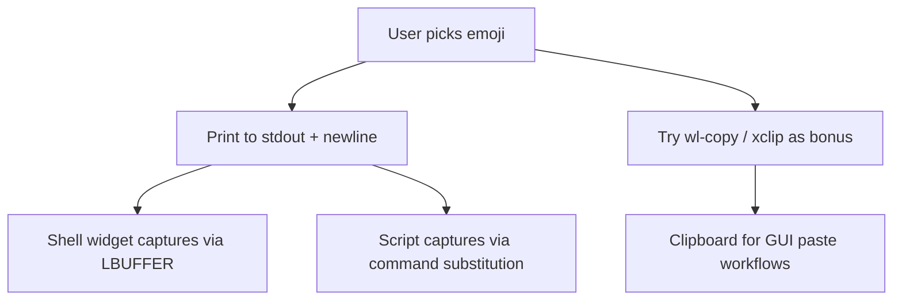

# Emojig: Zero-Allocation Emoji Picker

> [!NOTE]
> **Currency Status:** Current as of May 31, 2026. Matches the active architecture, features, and design goals of **Emojig v0.1.0**.

A high-performance, low-memory emoji picker in Zig. Runs as an inline TUI in any terminal,
as a floating GUI window on Wayland/X11, or as a shell widget (fzf-style) that inserts the
selected emoji at the cursor via stdout capture.

---

## 1. Architecture & Output Modes

Emojig has three output modes, selected automatically based on context:

```
emojig (no args)
  ├── GUI session + foot available  → floating foot window
  ├── Interactive TTY, no GUI       → inline TUI, stdout capture
  └── No TTY, no GUI                → error

emojig --gui    → force floating window (foot)
emojig --tui    → force inline TUI
$(emojig)       → inline TUI on /dev/tty, emoji on stdout (shell widget)
```

### Output path



TUI I/O goes to `/dev/tty` directly so stdout is always clean for capture.
This is the same approach used by fzf.

### UX & Layout

- Search bar: `🔍` prompt, live fuzzy filtering as you type
- 6×4 grid: top 24 matches, uniform 3-char cell width, no box-drawing
- Description row: selected emoji name in real time
- Theme toggle: Tab or click the theme icon; persisted to `~/.config/emojig/config`
- Controls: arrow keys (both normal `\x1b[` and application `\x1bO` mode), mouse
  click, Enter to confirm, Escape/Ctrl-C to cancel

---

## 2. Debug & Memory Logging

On close (normal exit, signal, or panic) emojig reads `/proc/self/statm` via zero-
allocation POSIX calls and appends a timestamped entry to `/tmp/emojig.log`.

Observed RSS: under **2.0 MB** during standard operation.

---

## 3. Data & Search

**Database**: 1,870 Unicode emojis packed into an 82 KB binary (`src/emojis.bin`),
embedded at compile time via `@embedFile`. Zero runtime allocation for DB access.

**Search engine** (`src/root.zig`): fzf-style subsequence scoring, zero heap
allocations, with:
- Case-insensitive scoring with bonuses for consecutive matches and word starts
- Multi-term AND logic (space-separated)
- Plural fallback: `cars` → `car`, `buses` → `bus`
- Stem fallback: `racing` → `race`
- MRU: recently picked emojis float to the top on empty query

---

## 4. Implementation Phases

### Phase 1 — Emoji packing & embedded DB ✓
Binary database, string table deduplication, `@embedFile`.

### Phase 2 — Fuzzy search engine ✓
Subsequence scoring, plural/stem fallbacks, MRU, zero allocations.

### Phase 3 — 2D inline TUI ✓
6×4 grid, 2D arrow navigation, SGR mouse clicks, live name row.

### Phase 4 — POSIX signals & safe exit ✓
SIGINT/SIGTERM handlers, panic override, terminal always restored.

### Phase 5 — Memory logger & clipboard ✓
`/proc/self/statm` logging, `wl-copy`/`xclip` subprocess spawning.

### Phase 6 — Theming ✓
Dark/light/system themes, OSC 11 background detection, Tab toggle, config persistence.

### Phase 7 — Self-managing binary ✓
Auto-detect GUI vs TUI mode. `--gui` spawns foot with correct geometry. `--tui` forces
inline TUI. `--wait` blocks until foot window closes. Desktop `.desktop` + SVG icon
written on first `--gui` run. Virtual console guard (`TERM=linux`).

### Phase 8 — stdout / shell integration ✓
TUI writes to `/dev/tty`; stdout is clean for shell capture. Selected emoji printed to
stdout after TUI teardown. Shell snippets in `shell/` for zsh, bash, fish (Ctrl+E widget).
Handles both normal (`\x1b[A`) and application (`\x1bOA`) cursor key modes — fixes arrow
keys inside ZLE widgets where zsh activates `smkx`.

### Phase 9 — Shell snippet distribution (next)
- Ship `shell/` snippets in release tarballs
- `--install-shell-integration [zsh|bash|fish]` flag to append the snippet to the
  user's rc file
- Document in README

### Phase 10 — macOS / SSH (pending)
- macOS: `/dev/tty` + stdout mode already works; clipboard via `pbcopy`. Needs CI runner.
- SSH: stdout mode works natively (no clipboard needed). Needs docs.

### Phase 11 — Release infrastructure (pending)
See `issues/02-distribution-and-release.md` for the full plan.
Short list: README, `--version`, GoReleaser config, Woodpecker + GitHub Actions CI,
Codeberg + GitHub remotes, minisign keypair, AUR/Nix/Homebrew packages.

---

## 5. Architectural Decisions

### Standalone binary (not daemon)
Rejected daemon/socket model: binary starts in < 2 ms, RSS < 2.0 MB during operation,
0 KB when idle. No Unix socket, no systemd unit, no lock files.

### Stdout + /dev/tty (not TIOCSTI)
Rejected TIOCSTI: disabled by default on Linux 6.2+ (requires `CAP_SYS_ADMIN` or
`sysctl dev.tty.legacy_tiocsti=1`). The fzf approach (TUI → `/dev/tty`, result → stdout,
shell widget inserts via `LBUFFER`/`READLINE_LINE`) is kernel-independent and composable.

### Clipboard as bonus, not primary
`wl-copy`/`xclip` are attempted after stdout write, silently ignored on failure. This
keeps VT + SSH workflows working without GUI dependencies.

### foot as GUI host (not a compositor widget)
A Wayland layer-shell overlay would require compositor-specific protocols. foot gives us
a floating window with correct geometry, fonts, and padding on any Wayland compositor
via standard window rules. `--gui` spawns foot with all flags baked in.
