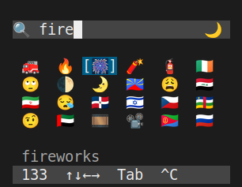
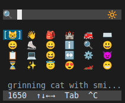
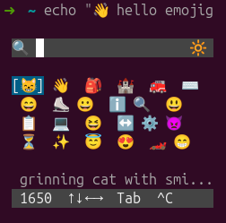
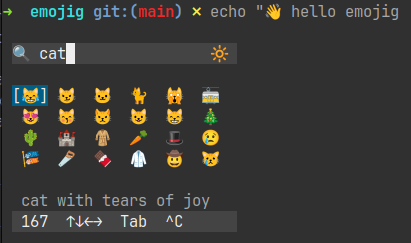
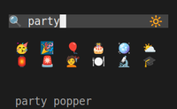
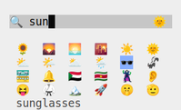

<!--
SPDX-FileCopyrightText: 2026 Uwe Jugel
SPDX-License-Identifier: AGPL-3.0-or-later
-->

# Emojig Screenshots

All screenshots taken on Ubuntu 24.04 with emojig v0.1.4.

---

## GUI mode — floating foot window

**`emojig --gui`** spawns a borderless `foot` window. Fuzzy search filters the grid
live as you type. The status bar shows the total match count and the currently
highlighted emoji name.

---

## Inline TUI — search results in Tilix

**`emojig --tui`** runs the picker inline inside your existing terminal. The grid
renders directly in the shell — no popup window needed. Works in any terminal that
supports VT sequences, including split-pane setups like Tilix.

---

## Stdout capture — piping the selection

**`emoji=$(emojig)`** — the TUI renders on `/dev/tty` so it appears on screen even
when stdout is redirected. After you confirm a pick the selected emoji is printed to
stdout and can be captured in a variable or piped directly to `wl-copy`.

---

## Inline TUI — full echo and cat workflow

A full pick-and-use sequence: invoke emojig inline, select an emoji, and use the
result immediately in subsequent shell commands. The TUI exit is clean — no leftover
ANSI artifacts in the scrollback.

---

## App icon (dark / light theme)

| Dark | Light |
|------|-------|
|  |  |
|  |  |

The icon ships in both SVG and PNG (128 × 128 px) and is installed to the system
hicolor theme via `emojig --install`. See [AppIcons.md](AppIcons.md) for the full
desktop integration story.
