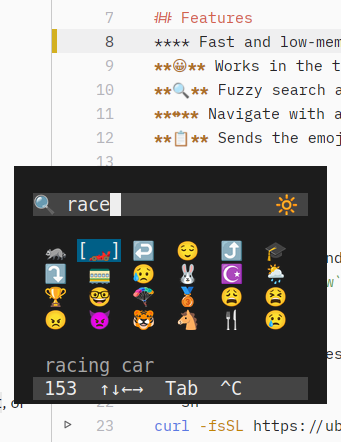
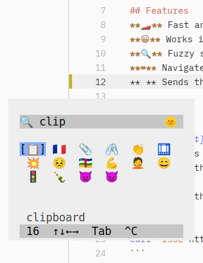

<!--
SPDX-FileCopyrightText: 2026 Uwe Jugel
SPDX-License-Identifier: AGPL-3.0-or-later
-->

# Emojig Screenshots

All screenshots taken on Ubuntu 24.04 with emojig v0.1.4.

---

## GUI Mode — Floating `foot` Window

Bind **`emojig --gui`** to a Desktop hotkey to spawn a borderless `foot` window. Fuzzy search filters the grid live as you type. The status bar shows the total match count and the currently highlighted emoji name.

---

## Inline TUI — Ctrl+E in in Tilix

**`emojig --tui`** runs the picker inline inside your existing terminal. The grid renders directly in the shell — no popup window needed. Works in any terminal that supports VT sequences, including split-pane setups like Tilix.

---

## Inline TUI — Ctrl+E in Ptyxis (Ubuntu Terminal)

Same example as Tilix above. `emojig` adopts the background colors from the terminal and only renders what is needed inline. It fully disapears when closed.
