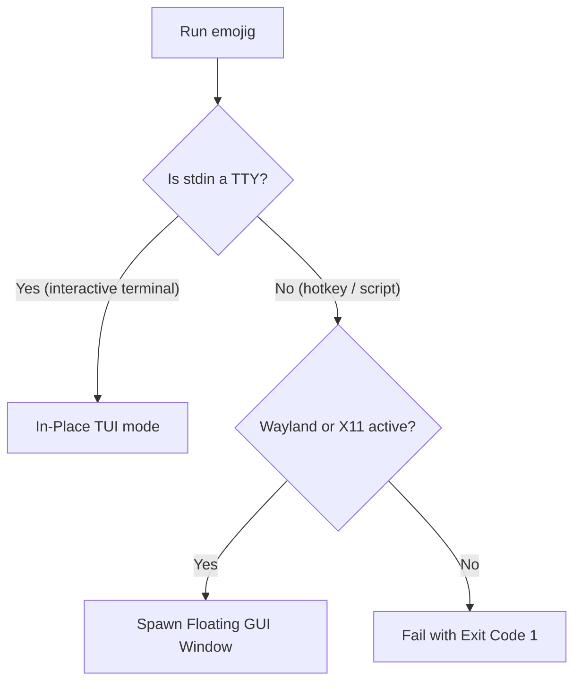

<!--
SPDX-FileCopyrightText: 2026 Uwe Jugel
SPDX-License-Identifier: AGPL-3.0-or-later
-->

# Terminal Integration & Deployment Stories

This document explains the integration mechanics of Emojig across terminal sessions, shell setups, graphical desktop environments (Wayland/X11), and the local system clipboard.

---

## 1. Universal Launch Modes: Auto-Detection (TUI vs. GUI)

Emojig operates as a single executable that adapts its launch interface dynamically. It mimics standard tools like `fzf` to support both command-line composition and floating window triggers.



### In-Place TUI Mode (`emojig --tui`)
When executed directly inside an active terminal session, Emojig runs in-place, drawing its interface directly beneath the shell prompt. This allows it to be piped:
```sh
# Copy search result directly to clipboard
emojig | wl-copy
```

### Floating GUI Popup (`emojig --gui`)
When invoked from a desktop hotkey or launcher shortcut, standard input is non-interactive (`can_use_tty == false`). Emojig automatically detects the graphical session and spawns a new instance of a lightweight terminal window (prefers `foot`, fallback to others like `kitty`, `alacritty`, `ghostty`) running `emojig --tui` in a borderless popup configuration by default.

* **Borderless GUI Option** (`--borderless`): Hides window decorations for terminals that expose CLI control flags (e.g. `foot csd.preferred=client csd.size=0`, `kitty --o hide_window_decorations=yes`, etc.).
* **Decorated GUI Option** (`--decorated` / `--window-decorations`): Keeps the terminal's normal title bar/window decorations so the picker can be dragged by the window manager. This is equivalent to `--borderless=false`.
* **Title Size** (`--title-size N`): Sets the foot CSD title bar height in pixels. Default (0) auto-detects from the GNOME system font size and text-scaling-factor via `gsettings` (formula: `pt × scale × 2.5`).
* **Window Title**: foot window always shows `😀 Emojig` (passed via `--override=title=...`).
* **Placement**: On Wayland, exact caret-relative popup placement is not a stable cross-desktop primitive. Focused-window placement should be compositor-specific and best-effort; see `issues/40-wayland-focused-window-placement.md`.
* **Auto-Dismiss**: Once an emoji is chosen, the terminal helper exits, auto-closing the popup instantly.

---

## 1b. Foot CSD Engineering Pitfalls

Foot's Client Side Decorations have several non-obvious behaviours that have bitten us. Record them here to avoid re-discovering them.

### GNOME Wayland: `csd.preferred=server` is a no-op

GNOME Shell does not implement the `xdg-decoration` Wayland protocol, so `csd.preferred=server` silently falls back to CSD anyway. Always use `csd.preferred=client` when you want a title bar under GNOME.

### `csd.size=0` in emojig's own foot.ini disables the bar

The borderless launch writes `csd.size=0` to foot.ini (which hides the bar and keeps only the border). When re-launching with `--decorated`, the inline `--override=csd.size=26` (then the auto-sized override) must come **after** the config load — it does, because `--override` flags win over config file values.

### `csd.font` `:size` attribute is ignored

From the foot man page: *"the font will be sized using the title bar size. That is, all :size and :pixelsize attributes will be ignored."* To change the visual weight of the title text, set `csd.font=monospace:bold` (the font family/weight are honoured; only the size is overridden by `csd.size`).

### Auto-detecting title bar height from the system font

The default 26px bar is too small when GNOME has a large or scaled UI font. Emojig queries:

```
gsettings get org.gnome.desktop.interface font-name       → 'Ubuntu Sans 11'
gsettings get org.gnome.desktop.interface text-scaling-factor → 1.0999999999999999
```

**Watch out:** `text-scaling-factor` returns a floating-point value as a string with full IEEE754 noise (`1.0999...` instead of `1.1`). Parse the first two decimal digits and round to nearest tenth before using.

Formula used: `csd_size = pt × round(scale, 1tenth) × 2.5` — integer arithmetic, all in tenths:
```
pt=11, scale10=11 (rounded from 1.0999...)
csd_size = 11 × 11 × 25 / 100 = 30
```

### `gtk-launch` relaunch strips CLI flags

When `emojig --gui` is invoked without `XDG_ACTIVATION_TOKEN` / `DESKTOP_STARTUP_ID` (e.g. from a key binding that hasn't gone through an activation-aware launcher), Wayland focus-stealing prevention rejects the new window. Emojig works around this by re-launching via `gtk-launch emojig-picker` which sends an activation token.

**But** `gtk-launch` reads the `.desktop` file's `Exec=` line, which is `emojig --gui` — no extra flags. Any CLI flags from the original invocation (e.g. `--decorated`, `--title-size=30`) are lost.

**Fix**: Before calling `gtk-launch`, write a timestamped lock file at `/tmp/emojig-relaunch-<uid>.lock` encoding all flags:

```
TIMESTAMP:BORDERLESS:TITLE_SIZE
```

The relaunched process reads the file within a 5-second window and restores the flags. New flag fields must be appended to this format (colon-separated), and the reader must be forward-compatible (ignore unknown trailing fields).

---

## 2. Shell Integrations (Bash, Zsh, Fish)

Shell integration scripts live in `src/shell/` and are embedded in the binary.
The key binding defaults to `Ctrl+E`; override with `EMOJIG_KEY`.

### Generic dispatcher: `emojig.sh`

`emojig.sh` is a POSIX-compatible dispatcher that sources the right
shell-specific script at runtime:

```sh
if test -n "$ZSH_VERSION"
then source ~/.local/share/emojig/shell/emojig.zsh
elif test -n "$BASH_VERSION"
then source ~/.local/share/emojig/shell/emojig.bash
fi
```

**Fish cannot parse POSIX `if/then/fi`** — fish always gets a direct
`source emojig.fish` line, never via `emojig.sh`.

### Installing

`--install` auto-detects `$SHELL`, writes an `if test -f` guard to the
appropriate rc file, and exits:

```
emojig --install
# → detects zsh, writes to ~/.zshrc (or ~/.userrc if it exists):
#   if test -f ~/.local/share/emojig/shell/emojig.sh
#   then source ~/.local/share/emojig/shell/emojig.sh
#   fi
```

**RC file resolution order** (non-fish):
1. `--rc FILE` override (relative to `$HOME` or absolute)
2. `~/.userrc` if it exists
3. `~/.zshrc` (zsh) or `~/.bashrc` (bash)

Fish always writes to `~/.config/fish/config.fish` (ignores `~/.userrc`).

`--install` is idempotent — it scans the first 16 KiB of the target file for
the marker string (`emojig/shell/emojig.sh` or `emojig/shell/emojig.fish`)
before appending.

### Eval workflow

As an alternative to `--install`, print the script to stdout for `eval`:

```sh
eval "$(emojig --completion)"            # auto-detect from $SHELL
eval "$(emojig --completion=zsh)"        # explicit shell
eval "$(emojig --completion --key '^Y')" # custom key: prepends EMOJIG_KEY='^Y'
```

`--completion` accepts `sh`, `zsh`, `bash`, or `fish`.

---

## 3. Desktop and App Icon Integration

To appear in desktop application menus, Emojig generates a standard `.desktop` entry and registers application icon formats on installation.

### Dual SVG/PNG Icon Strategies

1. **SVG (Scalable Vector Graphics)**: Main icon target written to `~/.local/share/icons/hicolor/scalable/apps/emojig-picker.svg`. This provides high-quality scaling for modern desktop environments.
2. **PNG (Portable Network Graphics) Fallback**: Many legacy launchers and notification daemons do not support SVG icons. To prevent broken or missing icons, Emojig compiles a 128x128 pixel PNG asset (baked into the binary) and writes it on install to:
   * `~/.local/share/icons/hicolor/128x128/apps/emojig-picker.png`
   * `~/.local/share/icons/emojig-picker.png` (direct local fallback)

The `.desktop` launcher utilizes the absolute path to this fallback PNG icon to guarantee compatibility across all window managers.

---

## 4. Safe Clipboard Integration (Spawning Child Pipes)

When copying an emoji to the clipboard, Emojig must invoke system utilities like `wl-copy` (Wayland), `xclip` / `xsel` (X11), or `pbcopy` (macOS).

### Safe Pipe Management Pitfalls
Spawning external clipboard utilities in Zig requires careful management of file descriptors. 

* **Pipe Lifecycle**: Do not double-close file descriptors. When you spawn a child process, writing the selected emoji sequence to the process's standard input pipe must be done by explicitly closing the write end after sending, signaling an EOF to the clipboard utility.
* **Non-blocking Execution**: Clipboard tools should be spawned asynchronously, allowing the main TUI binary to exit immediately once the copy command is handed off.

---

## 5. Terminal State Restoration on Exit

Tearing down the inline TUI without leaving artifacts (orphaned rows, a
displaced cursor, leaked mouse events, wiped scrollback) is its own minefield,
and the failure modes are **terminal-specific** — e.g. an unmatched
`\x1b[?1049l` is harmless in foot/tmux but displaces the cursor in every VTE
terminal (Tilix, GNOME Terminal, Ptyxis).

See [`TerminalRestore.md`](./TerminalRestore.md) for the teardown contract,
the cross-terminal pitfalls we hit, and the test matrix for teardown changes.
