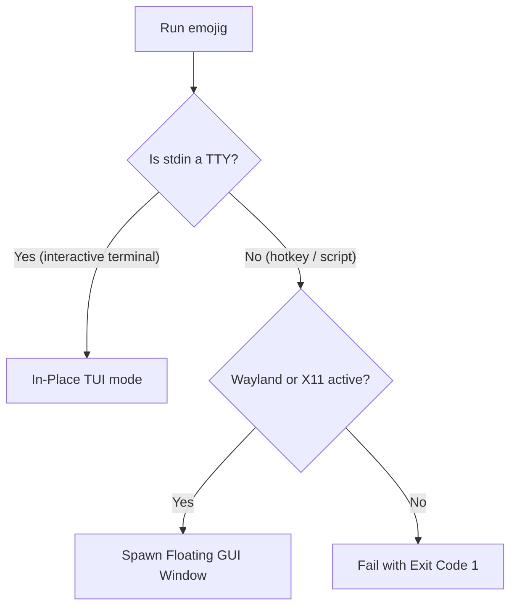

<!--
SPDX-FileCopyrightText: 2026 Uwe Jugel
SPDX-License-Identifier: AGPL-3.0-or-later
-->

# Terminal Integration & Deployment Stories

This document explains the integration mechanics of Emojig across terminal sessions, shell setups, graphical desktop environments (Wayland/X11), and the local system clipboard.

---

## 1. Universal Launch Modes: Auto-Detection (TUI vs. GUI)

Emojig operates as a single executable that adapts its launch interface dynamically. It mimics standard tools like `fzf` to support both command-line composition and floating window triggers.



### In-Place TUI Mode (`emojig --tui`)
When executed directly inside an active terminal session, Emojig runs in-place, drawing its interface directly beneath the shell prompt. This allows it to be piped:
```sh
# Copy search result directly to clipboard
emojig | wl-copy
```

### Floating GUI Popup (`emojig --gui`)
When invoked from a desktop hotkey or launcher shortcut, standard input is non-interactive (`can_use_tty == false`). Emojig automatically detects the graphical session and spawns a new instance of a lightweight terminal window (prefers `foot`, fallback to others like `kitty`, `alacritty`, `ghostty`) running `emojig --tui` in a borderless popup configuration.

* **Borderless GUI Option** (`--borderless`): Hides window decorations for terminals that expose CLI control flags (e.g. `foot -D csd.server-side=none`, `kitty --o hide_window_decorations=yes`, etc.).
* **Auto-Dismiss**: Once an emoji is chosen, the terminal helper exits, auto-closing the popup instantly.

---

## 2. Shell Integrations (Bash, Zsh, Fish)

To make emoji search accessible at the command line, Emojig embeds shell keybindings that inject the selected emoji directly into the active prompt buffer (defaulting to `Ctrl+E`).

The shell configuration scripts are embedded inside the binary and can be output using `emojig --init [bash|zsh|fish]`.

### Zsh Integration
Zsh uses a custom Widget and Zle (Zsh Line Editor) command:
```zsh
__emojig_widget() {
  local selected=$(emojig)
  if [ -n "$selected" ]; then
    LBUFFER+="$selected"
  fi
  zle reset-prompt
}
zle -N emojig-widget __emojig_widget
bindkey '^E' emojig-widget
```

### Bash Integration
Bash reads standard input using `readline` bindings:
```bash
__emojig_inject() {
  local selected=$(emojig)
  if [ -n "$selected" ]; then
    READLINE_LINE="${READLINE_LINE:0:$READLINE_POINT}${selected}${READLINE_LINE:$READLINE_POINT}"
    READLINE_POINT=$((READLINE_POINT + ${#selected}))
  fi
}
bindkey -x '"\C-e": __emojig_inject'
```

### Fish Integration
Fish handles insertion via command bindings:
```fish
function __emojig_inject
  set -l selected (emojig)
  if test -n "$selected"
    commandline -i $selected
  end
  commandline -f repaint
end
bind \ce __emojig_inject
```

---

## 3. Desktop and App Icon Integration

To appear in desktop application menus, Emojig generates a standard `.desktop` entry and registers application icon formats on installation.

### Dual SVG/PNG Icon Strategies

1. **SVG (Scalable Vector Graphics)**: Main icon target written to `~/.local/share/icons/hicolor/scalable/apps/emojig-picker.svg`. This provides high-quality scaling for modern desktop environments.
2. **PNG (Portable Network Graphics) Fallback**: Many legacy launchers and notification daemons do not support SVG icons. To prevent broken or missing icons, Emojig compiles a 128x128 pixel PNG asset (baked into the binary) and writes it on install to:
   * `~/.local/share/icons/hicolor/128x128/apps/emojig-picker.png`
   * `~/.local/share/icons/emojig-picker.png` (direct local fallback)

The `.desktop` launcher utilizes the absolute path to this fallback PNG icon to guarantee compatibility across all window managers.

---

## 4. Safe Clipboard Integration (Spawning Child Pipes)

When copying an emoji to the clipboard, Emojig must invoke system utilities like `wl-copy` (Wayland), `xclip` / `xsel` (X11), or `pbcopy` (macOS).

### Safe Pipe Management Pitfalls
Spawning external clipboard utilities in Zig requires careful management of file descriptors. 

* **Pipe Lifecycle**: Do not double-close file descriptors. When you spawn a child process, writing the selected emoji sequence to the process's standard input pipe must be done by explicitly closing the write end after sending, signaling an EOF to the clipboard utility.
* **Non-blocking Execution**: Clipboard tools should be spawned asynchronously, allowing the main TUI binary to exit immediately once the copy command is handed off.
