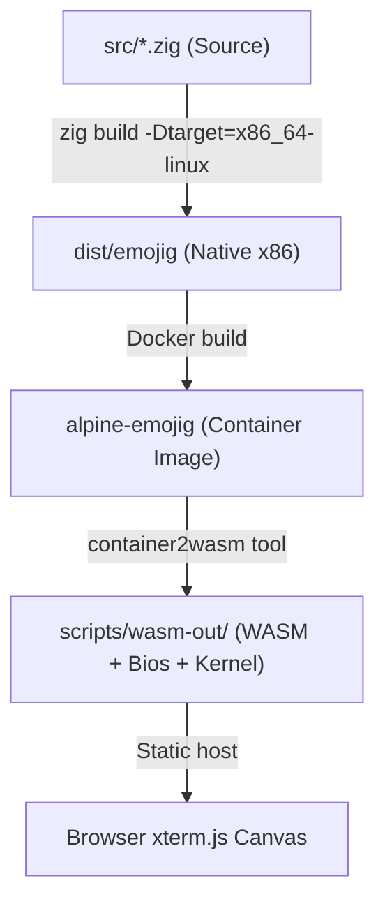

<!--
SPDX-FileCopyrightText: 2026 Uwe Jugel
SPDX-License-Identifier: AGPL-3.0-or-later
-->

# Web Sandbox & Interactive Browser Demos

This document details the architecture, build pipeline, and integration patterns for running the native compiled `emojig` binary inside a sandboxed web browser environment.

---

## 1. Sandbox Architecture Comparison

Running a native Zig application (which expects a standard POSIX environment with `/dev/tty`, raw termios attributes, and signal interrupts) in a static browser environment can be achieved via three distinct pathways:

| Metric | Path A: Server-Side Container Stream (`ttyd`) | Path B: Client-Side CPU Emulation (`container2wasm`) | Path C: Client-Side Simulator (`website/simulator.js`) |
| :--- | :--- | :--- | :--- |
| **Execution** | Linux container on server | Browser WASM thread | Pure client JS execution |
| **Fidelity** | **Perfect** (uses real PTY) | **High** (emulates CPU and kernel) | **Visual only** (re-implemented logic) |
| **Mouse Tracking** | Perfect SGR sequences | Full simulation via `xterm-pty` | Custom HTML mouse handlers |
| **Server Cost** | High (ongoing VM execution) | **Zero** (static file hosting) | **Zero** (static file hosting) |
| **Latency** | Instant startup (<100ms) | Moderate (2s startup boot) | Instant startup (<50ms) |
| **Asset Size** | ~1 MB (CSS/JS) | ~15 MB (Kernel + CPU WASM) | ~50 KB (JS/CSS) |

---

## 2. WASM CPU Emulation Pipeline (`container2wasm`)

To achieve a static client-side browser demo without maintaining virtual machines, Emojig compiles a native Linux x86 binary, packs it into an Alpine container image, and converts the container into a client-side WASM blob using `container2wasm`.



### Compilation Script (`scripts/wasm_demo.go`)
An offline Go script automates this pipeline.
1. Compile the Zig binary with target `x86_64-linux` and optimize for size (`ReleaseSmall`).
2. Generate a Dockerfile that copies the executable and downloads the Noto Emoji font (required for rendering glyphs).
3. Invoke `container2wasm` to transpile the Docker image into x86 WebAssembly, outputting:
   * `emojig-kernel.wasm` (QEMU/TCG translation layer)
   * `rootfs.img` (compressed read-only container root file system)
4. Load the output files inside a client-side HTML container with `xterm.js` and `xterm-pty` to bind keyboard keystrokes and SGR mouse clicks to the virtual system's `/dev/tty`.

---

## 3. Simulator Mirroring (`website/simulator.js`)

For the lightest possible page size, the repository includes a pure JavaScript/CSS implementation of the emoji grid (`website/simulator.js` + `simulator.css`). This acts as a pixel-faithful interactive mock.

> [!IMPORTANT]
> **Layout Synchronization Requirement**  
> If the layout constants (like `cols`, `rows`, or status/search margins) are updated in [defaults.zig](file:///home/uwe/projects/emojig/src/defaults.zig) or [main.zig](file:///home/uwe/projects/emojig/src/main.zig), they **must be mirrored in `website/simulator.js`** to ensure the web demo and native code remain in perfect alignment.

### Shared Layout Formulas
* **Columns / Cell size**: Grid cells occupy exactly 4 columns.
* **Row Budget**:
  ```
  1 top padding + 1 search bar + 1 spacer + N grid rows + 1 spacer + 1 description + 1 status bar
  ```
* **Selection Brackets**: Active selection highlights using `[` and `]` wrappers styled with background colors.
