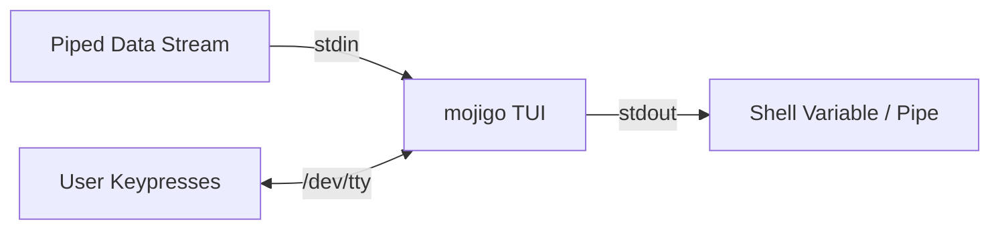

<!--
SPDX-FileCopyrightText: 2026 Uwe Jugel
SPDX-License-Identifier: AGPL-3.0-or-later
-->

# How to Build the Perfect Inline TUI

An **inline Terminal User Interface (TUI)** is an interactive program that renders directly within the standard terminal scrollback buffer (underneath the active shell prompt) rather than switching to the fullscreen alternate screen buffer (`\x1b[?1049h`). 

When built correctly, an inline TUI integrates seamlessly into UNIX shell pipelines, handles terminal resizing gracefully, and exits leaving only the final selection visible.

This guide details the architectural decisions, UNIX systems programming context, and rendering algorithms used by `mojigo` to achieve a stable, flicker-free, and pipeline-friendly inline terminal interface.

---

## 1. I/O Separation: Dedicated `/dev/tty` Access

### The Problem
Traditional interactive terminal programs read from standard input (`stdin`) and write to standard output (`stdout`) or standard error (`stderr`). However, this breaks standard Unix pipes:
```bash
# We want to feed a list of candidates into our selector,
# and capture the chosen candidate into a variable.
selection=$(cat candidates.txt | mojigo)
```
If the TUI reads keyboard input from `stdin`, it will immediately consume the piped data (`candidates.txt`) as user keystrokes. If it writes the user interface to `stdout`, the interface will be captured inside the variable `selection`, corrupting it.

### The Solution
To build a pipeline-compatible inline TUI, you must completely separate standard streams from the interactive interface:

1. **`stdin` (Standard Input)** is reserved for piping incoming data streams (the "haystack").
2. **`stdout` (Standard Output)** is kept completely silent during execution, reserved only for printing the final selection on exit.
3. **`/dev/tty` (The Controlling Terminal)** is opened explicitly for reading and writing:
   * **Keyboard Input**: Read directly from `/dev/tty`.
   * **TUI Rendering**: Written directly to `/dev/tty`.



### Deep-Dive: Controlling Terminal
In Unix-like systems, `/dev/tty` is a special character device that acts as a synonym for the controlling terminal of the current process group. 
Even if `stdin`, `stdout`, and `stderr` are redirected to files, sockets, or pipes, `/dev/tty` remains connected to the physical or virtual terminal session. Opening `/dev/tty` via `os.OpenFile("/dev/tty", os.O_RDWR, 0)` guarantees a direct, unbuffered channel to read raw keystrokes and write ANSI escape codes.

---

## 2. Constant Height & Viewport Stability

### The Problem
If the TUI draws a dynamic number of lines depending on its state (e.g., shrinking the list when filtering, or expanding it to show a help window), the terminal cursor moves up and down by variable offsets. This causes:
1. **Vertical Jitter**: The entire terminal viewport shakes as rows are cleared and redrawn.
2. **Scrollback Pollution**: When drawing near the bottom of the terminal window, expanding the UI height forces the terminal emulator to scroll the scrollback history upward, permanently pushing previous command lines off the screen.

### The Solution: Padded Viewport
The TUI must calculate the absolute maximum height it can occupy across all modes (normal grid vs. help screen) at startup.
Every single frame written to the terminal must be padded to this exact height with blank lines.

```go
// Calculate maximum height occupied by any view mode
func (a *App) height() int {
    hGrid := a.specs.Layout.TUI.Rows + 5 // Grid rows + search bar + spacers + status
    hHelp := len(a.specs.Strings.HelpLines) + 4 // Help page lines + headers
    if hHelp > hGrid {
        return hHelp
    }
    return hGrid
}
```

When rendering the frame:
1. Convert the frame buffer to a list of lines.
2. If the active view (e.g., the grid) is shorter than the maximum height, pad the array with blank lines *before* the bottom status row is appended.
3. Draw the exact number of padded lines. This maintains a constant vertical footprint, guaranteeing that the viewport never scrolls or jumps.

---

## 3. No-Scroll Cursor Movement (`CUD` vs `LF`)

### The Problem
Moving the cursor downward using newlines (`\n`, or Line Feed `LF`) is the most common cause of inline TUI layout breakdown. 
When the cursor is at the bottom row of the visible terminal viewport, emitting `\n` forces the terminal emulator to scroll the entire screen buffer upward by one line to make room for the new line. This pushes the initiating shell prompt into the scrollback, leaving orphaned rows behind.

### The Solution: Cursor Down (`CUD`)
Instead of `\n` or `\r\n`, the TUI must navigate downward using the explicit ANSI **Cursor Down (CUD)** escape sequence:
`\x1b[B` (or `\x1b[B\r` to reset to the margin).

| Feature | Line Feed (`LF` / `\n`) | Cursor Down (`CUD` / `\x1b[B`) |
| :--- | :--- | :--- |
| **Origin** | ASCII / ISO 646 C0 Control | ECMA-48 / ANSI X3.64 CSI Sequence |
| **Command** | "Feed a new line" | "Move active position downward" |
| **Bottom Behavior** | **Scrolls** viewport if at bottom margin | **Clamps** at bottom margin without scrolling |
| **Use Case** | Standard stream output | Precise TUI rendering & UI updates |

By using `\x1b[B` to move downward during rendering, you guarantee that even if the TUI is drawn at the absolute bottom of the terminal window, it will clamp its bottom rows instead of forcing a screen scroll.

---

## 4. Guarding Against Character Drift (`\r\x1b[2K`)

### The Problem
During redrawing, the TUI must erase previous text on each line before writing new content. The standard ANSI sequence to erase the current line is **Erase in Line (EL)**:
`\x1b[2K`

However, `\x1b[2K` only erases the characters; it **does not move the cursor** back to the beginning of the line. The cursor remains at whatever column it was located. If you write new content immediately after `\x1b[2K`, it will be written starting from that column, causing text to drift rightward.

On terminal resize, this drift compounds, causing columns to wrap and corrupt the UI.

### The Solution: Carriage Return Prefix
Every line erasure and movement operation must be prefixed with a **Carriage Return (`\r`)**:
`\r\x1b[2K`

The carriage return resets the cursor position to Column 1. Combined with `\x1b[2K`, it guarantees that the entire line is cleared and the cursor is ready to write new text starting from the left margin.

---

## 5. Space Reservation & Top-Resting Invariant

### Viewport Space Reservation
When an inline TUI starts, it must reserve its viewport area by printing `H - 1` empty lines (where `H` is the computed constant TUI height) to push the terminal contents up. It then immediately moves the cursor back up to the top of this reserved region before drawing:

```go
h := a.height()
// Reserve vertical space
for i := 0; i < h-1; i++ {
    tty.WriteString("\n")
}
// Move cursor back to the top of the TUI region
tty.WriteString(fmt.Sprintf("\x1b[%dA\r", h-1))
```

### The Top-Resting Invariant
At the end of every frame redraw, the cursor must be returned to the **top row of the TUI region** (Row 0) and positioned at the active input column in the search bar. 

Leaving the cursor resting at the bottom of the TUI region between frames is dangerous: if the terminal emulator window is resized vertically, terminal emulators automatically scroll the screen to keep the active cursor row visible. By keeping the cursor resting at the top of the TUI region, you minimize the risk of vertical window shrinks causing scrolls.

---

## 6. Terminal State & Raw Recovery

To read individual keystrokes (uncooked mode) and track mouse events, the terminal is configured into raw mode. However, if the process exits, crashes, or panics, it must restore standard terminal settings.

### Graceful Signal Handling
Unix signals (like `SIGINT` / Ctrl+C and `SIGTERM`) terminate the program immediately, bypassing normal programming language defers or exit routines. The TUI must intercept these signals to restore the terminal attributes:

```go
func (t *Terminal) installSignalHandler() {
    ch := make(chan os.Signal, 1)
    signal.Notify(ch, syscall.SIGINT, syscall.SIGTERM)
    go func() {
        <-ch
        t.Restore()
        os.Exit(130) // Standard 128 + SIGINT exit code
    }()
}
```

### The Restore Handshake
During restoration (`Restore()`), the TUI must:
1. Turn off mouse tracking (`\x1b[?1003l\x1b[?1006l`).
2. Show the cursor (`\x1b[?25h`).
3. Clear all TUI lines and return the cursor to the top of the region.
4. Set the terminal back to cooked mode (`TCSETS` with original `termios`).
