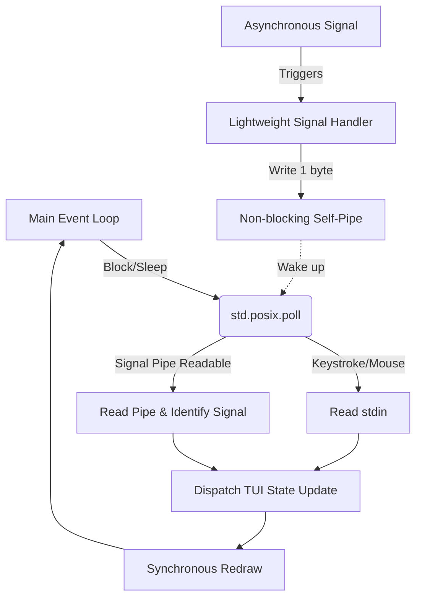

<!--
SPDX-FileCopyrightText: 2026 Uwe Jugel
SPDX-License-Identifier: AGPL-3.0-or-later
-->

# Zig TUI Architecture: Microcontroller-Style Event Loop

This document outlines the design for an allocation-free, super-fast, microcontroller-style TUI event loop for the Zig application (`emojig`). 

By mimicking the architecture of bare-metal embedded systems (using lightweight event polling and a "self-pipe" interrupt pattern), we can eliminate asynchronous race conditions, ensure safe terminal restoration on exit or panic, and run with zero heap allocations.

---

## 1. Embedded Systems Philosophy: Polling & ISRs

In microcontroller frameworks (like Arduino or FreeRTOS), the system typically runs a single-threaded main execution loop (`loop()`). Asynchronous hardware events (like pin toggles or timer ticks) trigger **Interrupt Service Routines (ISRs)**. 

To prevent concurrency bugs, an ISR must be extremely lightweight: it does not perform processing or memory allocation. Instead, it sets a volatile flag or writes to a hardware queue, then immediately returns. The main loop then polls this queue and processes the event synchronously.

In a Unix CLI environment:
* **Hardware Interrupts** are mapped to **POSIX Signals** (`SIGINT`, `SIGTERM`, `SIGWINCH`).
* **ISRs** are mapped to **POSIX Signal Handlers**.
* **Event Queue** is mapped to a **Non-blocking Self-Pipe** or **Linux `signalfd`**.
* **Sleep Mode** is mapped to a blocking **`std.posix.poll`** system call.



---

## 2. Event Dispatcher Design

We represent all incoming terminal activities as a compile-time sized `Event` tagged union:

```zig
const MouseEvent = struct {
    col: usize,
    row: usize,
    button: u8,
    is_release: bool,
};

const Event = union(enum) {
    key: u8,
    arrow: enum { up, down, left, right },
    mouse: MouseEvent,
    resize: struct { cols: usize, rows: usize },
    quit,
};
```

---

## 3. Safe Asynchronous Signal Handling: The Self-Pipe

Traditional signal handlers are highly restricted. They can only call **async-signal-safe** functions. Calling non-safe functions (like memory allocators, printf, or terminal status modification) leads to deadlocks or memory corruption if a signal interrupts the program mid-allocation.

The **self-pipe trick** solves this by converting asynchronous signals into synchronous file descriptor events:

1. Create a pipe using `std.posix.pipe()`.
2. Configure both ends of the pipe to be non-blocking (`O_NONBLOCK`).
3. Add the read end of the pipe to your `std.posix.pollfd` array alongside `/dev/tty`.
4. In the signal handler (the ISR), write a single byte to the write end of the pipe.
5. `poll` will wake up immediately, and the main thread can safely drain the pipe and handle the signal.

---

## 4. Compile-Ready Reference Implementation

Here is the complete, allocation-free event loop template. This code is fully self-contained and demonstrates the entire lifecycle:

```zig
const std = @import("std");

// Global pipe file descriptor for signal handlers
var sig_pipe_write_fd: std.posix.fd_t = -1;

// Thread-safe / Async-signal-safe ISR
fn signalInterruptHandler(sig: std.posix.SIG) callconv(.c) void {
    const sig_byte = @as(u8, @intCast(sig));
    _ = std.posix.system.write(sig_pipe_write_fd, &sig_byte, 1);
}

pub fn main() !void {
    const tty_fd = try std.posix.openat(std.posix.AT.FDCWD, "/dev/tty", .{ .ACCMODE = .RDWR }, 0);
    defer std.posix.close(tty_fd);

    // 1. Initialize Non-blocking Self-Pipe
    var pipe_fds: [2]std.posix.fd_t = undefined;
    try std.posix.pipe(&pipe_fds);
    const sig_pipe_read_fd = pipe_fds[0];
    sig_pipe_write_fd = pipe_fds[1];
    defer std.posix.close(sig_pipe_read_fd);
    defer std.posix.close(sig_pipe_write_fd);

    // Set non-blocking on pipe descriptors to prevent deadlocks
    var flags = try std.posix.fcntl(sig_pipe_read_fd, std.posix.F.GETFL, 0);
    _ = try std.posix.fcntl(sig_pipe_read_fd, std.posix.F.SETFL, flags | @as(usize, @intCast(std.posix.O.NONBLOCK)));
    flags = try std.posix.fcntl(sig_pipe_write_fd, std.posix.F.GETFL, 0);
    _ = try std.posix.fcntl(sig_pipe_write_fd, std.posix.F.SETFL, flags | @as(usize, @intCast(std.posix.O.NONBLOCK)));

    // 2. Register Signals (SIGINT / SIGTERM / SIGWINCH)
    var act = std.posix.Sigaction{
        .handler = .{ .handler = signalInterruptHandler },
        .mask = std.mem.zeroes(std.posix.sigset_t),
        .flags = 0,
    };
    try std.posix.sigaction(std.posix.SIG.INT, &act, null);
    try std.posix.sigaction(std.posix.SIG.TERM, &act, null);
    try std.posix.sigaction(std.posix.SIG.WINCH, &act, null);

    // 3. Configure Poll Descriptors
    var fds = [2]std.posix.pollfd{
        .{ .fd = tty_fd, .events = std.posix.POLL.IN, .revents = 0 },
        .{ .fd = sig_pipe_read_fd, .events = std.posix.POLL.IN, .revents = 0 },
    };

    std.debug.print("Event Loop Started. Press Ctrl+C or resize window to test.\n", .{});

    // 4. Main Event Loop (Allocation-Free)
    while (true) {
        // Blocks until an input key is pressed OR a signal interrupt byte is written to the pipe
        _ = try std.posix.poll(&fds, -1);

        // Check for Signal Interrupts
        if (fds[1].revents & std.posix.POLL.IN != 0) {
            var sig_buf: [16]u8 = undefined;
            const rc = std.posix.read(sig_pipe_read_fd, &sig_buf) catch 0;
            for (sig_buf[0..rc]) |sig| {
                const signal_type = @as(std.posix.SIG, @enumFromInt(sig));
                switch (signal_type) {
                    std.posix.SIG.INT, std.posix.SIG.TERM => {
                        std.debug.print("\r\nExit signal received ({d}). Cleaning up...\r\n", .{sig});
                        return;
                    },
                    std.posix.SIG.WINCH => {
                        std.debug.print("\r\nTerminal resize event received (SIGWINCH).\r\n", .{});
                        // Safe to query winsize here since we are in the main thread!
                    },
                    else => {},
                }
            }
        }

        // Check for Keyboard / Mouse Input
        if (fds[0].revents & std.posix.POLL.IN != 0) {
            var read_buf: [64]u8 = undefined;
            const rc = std.posix.read(tty_fd, &read_buf) catch 0;
            if (rc > 0) {
                const keys = read_buf[0..rc];
                std.debug.print("Raw input bytes: {any}\r\n", .{keys});
                if (keys[0] == 'q' or keys[0] == 3) {
                    std.debug.print("Quit key pressed.\r\n", .{});
                    return;
                }
            }
        }
    }
}
```

---

## 5. Architectural Benefits for Emojig

1. **Zero Allocations**:
   By using native fixed-size arrays for `pollfd` and stack buffers for reading, the dispatcher operates with `O(1)` memory overhead, requiring no allocator initialization.
2. **Deterministic Shutdown**:
   Because signals are processed synchronously inside the event loop, there is zero risk of the signal handler interrupting an active print statement or mutating terminal state halfway through a frame draw.
3. **No Alt-Screen Glitches**:
   Window resize events (`SIGWINCH`) are captured synchronously. Redrawing is only performed on the next tick of the event loop, avoiding frame tearing or line wrapping during aggressive terminal resizing.
