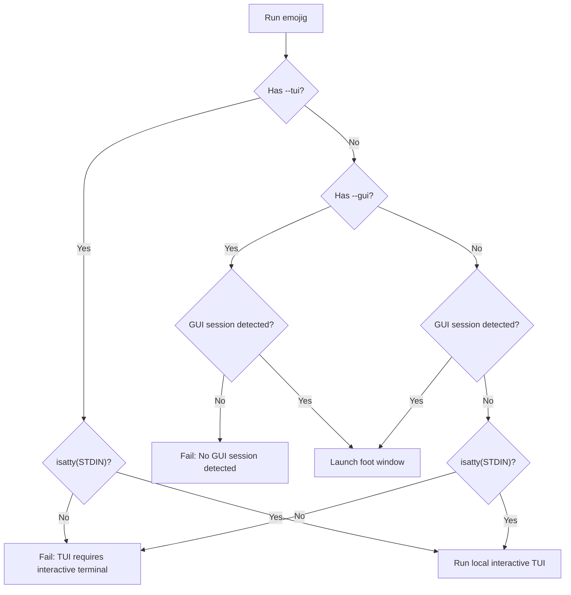

# Implementation Plan: Plain Terminal & Self-Sustained Window Management

> [!NOTE]
> **Currency Status:** Current as of May 31, 2026. Outlines the standalone binary architecture, no-GUI fallback, and terminal detection for **Emojig v0.1.0**.

This plan outlines the architecture and steps to make `emojig` a completely self-sustained binary that handles terminal window management, fallback TUI execution, and GUI desktop integrations natively without external shell wrappers.

---

## 1. Core Objectives

* **Self-Sustained Binary**: Remove the shell launcher script from the build system and configuration steps.
* **Plain Terminal / No-GUI Support**: Automatically run as a modal TUI in the current session if no GUI is present.
* **Flexible Execution Modes**:
  * `emojig` (no options): Open floating window if GUI is active; fall back to local modal TUI otherwise.
  * `emojig --gui`: Force floating terminal window or fail with exit code `1` if no GUI session is detected.
  * `emojig --tui`: Force local modal TUI session or fail with exit code `1` if standard input is not a terminal.
* **GUI Icon Fix**: Auto-install `.desktop` and SVG icon files to user directories on launch if they are missing, ensuring correct taskbar/dock icons.
* **Zero Allocations**: Maintain the project's zero-allocation performance profile in the CLI parsing, configuration reading, and window management code path.

---

## 2. Target Execution Flow



---

## 3. Subsystem Designs

### 3.1 CLI Argument Parser & Configuration Loading
The existing CLI parser in `src/main.zig` will be refactored to support key options without heap allocation.

* **Unified Configuration Loader**:
  * A helper function `loadConfig` will parse `~/.config/emojig/config` in a single pass.
  * Extracted keys: `theme`, `width`, `height`, and `border`.
* **Zero-Allocation Argument Parsing**:
  * CLI arguments override configurations and environment variables.
  * Option variables: `opt_tui` (bool), `opt_gui` (bool), `opt_wait` (bool), `opt_theme` (?Theme), `opt_width` (?usize), `opt_height` (?usize), `opt_border` (?bool).

### 3.2 Graphical Session Detection
To detect a GUI/WM session without external dependencies, `emojig` will inspect environment variables:
* If either `WAYLAND_DISPLAY` or `DISPLAY` is non-empty, a graphical session is active.
* If neither is set, no graphical environment is available.

### 3.3 Native Subprocess Launching
When spawning the floating window, the binary will invoke `foot` directly using `std.process.spawn`:
* **Path Resolution**: Resolve `/proc/self/exe` via `std.fs.readLinkAbsolute` to get the absolute path to the active binary.
* **Timeout Wrapper**: If the `EMOJIG_PICKER_TIMEOUT` environment variable is set (defaulting to `60` seconds), run `foot` via `timeout <duration> foot ...` to ensure resource collection if left unattended.
* **Stack Allocation**: All CLI argument string formatting (e.g. `--window-size-chars`, color overrides) will be written to stack-allocated buffers.
* **Execution Options**:
  * By default, the parent process exits immediately after spawning `foot` (non-blocking execution).
  * If the `--wait` flag is provided, the parent process blocks via `std.process.Child.wait` until the spawned terminal window closes.

### 3.4 Automatic Desktop Integration (GUI Icon Fix)
To map the window `app-id` (`emojig-picker`) to an icon, the binary will ensure these user files are present:
1. **Desktop Entry**: `~/.local/share/applications/emojig-picker.desktop`
   ```ini
   [Desktop Entry]
   Type=Application
   Name=Emojig Picker
   Comment=Interactive emoji picker
   Exec=/path/to/emojig --gui
   Icon=emojig-picker
   Terminal=false
   Categories=Utility;
   StartupWMClass=emojig-picker
   ```
2. **Scalable SVG Icon**: `~/.local/share/icons/hicolor/scalable/apps/emojig-picker.svg`
   ```xml
   <svg xmlns="http://www.w3.org/2000/svg" viewBox="0 0 100 100">
     <text y="0.9em" font-size="80">😀</text>
   </svg>
   ```

* The binary will resolve the absolute path to itself to write a precise `Exec` entry.
* If directories under `~/.local/` do not exist, the binary will create them sequentially via `mkdir`.

---

## 4. Implementation Steps

### Phase 1: Configuration & CLI Core (`src/main.zig`)
1. Create `loadConfig` function to parse theme, width, height, and border from `~/.config/emojig/config`.
2. Refactor argument loop in `main` to collect and validate all overrides.
3. Validate TUI interactivity with `std.posix.isatty`.

### Phase 2: Native Window Spawning & Desktop Integration (`src/main.zig`)
1. Implement `ensureDesktopIntegration` to write the `.desktop` and SVG icon files.
2. Implement `spawnFootWindow` to construct argument list on stack and run `std.process.spawn`.
3. Handle failure modes (e.g. `foot` not in `$PATH`) with informative messages.

### Phase 3: Build Integration (`build.zig`)
1. Replace shell script commands in `build.zig` with a direct call to the compiled artifact.
2. Update tests to verify fallback behaviors.

---

## 5. Verification & Testing

* **TUI Non-interactive Fallback**: Run `echo "test" | zig-out/bin/emojig --tui`. It must exit with code `1` and print a descriptive error.
* **No-GUI Simulation**: Unset environment variables (`unset WAYLAND_DISPLAY DISPLAY`) and run `zig-out/bin/emojig`. It must execute in-place in the current terminal session.
* **GUI Execution**: Run `zig-out/bin/emojig --gui`. It must launch the floating `foot` window and exit the parent command immediately.
* **GUI Waiting Execution**: Run `zig-out/bin/emojig --gui --wait`. It must launch the floating `foot` window and keep the parent terminal process running until the `foot` window is closed.
* **Desktop Integration**: Verify files are written to `~/.local/share/` and the dock displays the emoji icon when the window opens.
