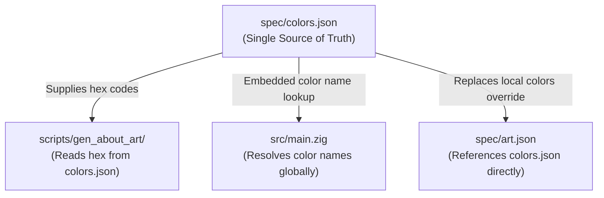

# Color System Simplification & Single Source of Truth

**Status:** Open  
**Priority:** P2  

---

## 🔍 Context and Current Architecture

The color system in **Emojig** is currently split across three distinct definitions and parsing layers:

1. **Global Dictionary (`spec/colors.json`)**:
   Contains definitions for all 256 xterm colors, including their index, systematic name (`rgbRGB` or `grayNN`), hex color code, short code, and aliases. Curation maps common names (e.g. `"orange"` = 208, `"teal"` = 30) for human-friendly typing.
2. **Theme/Palette Specification (`spec/theme.json`)**:
   Sets the semantic color tokens (like `grid_fg`, `selection_bg`, `search_bg`) for `.light` and `.dark` themes mapping directly to xterm-256 indices or hex values (for terminal OSC backgrounds).
3. **Art Frame Composition (`spec/art.json` and `scripts/gen_about_art/main.go`)**:
   Used at compile-time to resample PNG image frames into ANSI quad-block strings.

---

## ⚠️ Issues & Chaos Identified

Upon review, the color system contains several redundancies, inconsistencies, and hardcoded duplications:

### 1. Duplicate & Conflicting Color Names
* **Pink Inconsistency**: In the global dictionary (`spec/colors.json`), `"pink"` is defined as index **200**. However, in `spec/art.json`'s local `"colors"` override block, `"pink"` is defined as index **209**.
* **White Mapping**: White is resolved variously as standard basic color 7, index 15, or index 255 depending on the pathway, causing semantic ambiguity.

### 2. Local Color Names Bypass the Global Dictionary
* `spec/art.json` maintains its own local `"colors"` map (e.g. `"Bright Amber": 214`, `"Dark Gold": 178`, `"Midnight Blue": 24`). 
* The art generator script `scripts/gen_about_art/main.go` only resolves color names against this local map. You cannot use any global color names from `spec/colors.json` directly within `spec/art.json` without duplicating them in the local map first.

### 3. Hardcoded RGB Conversion Map in the Generator
* To compute Euclidean color distances from PNG pixels to the xterm palette, the generator script needs RGB values for xterm indices.
* Rather than loading these from `spec/colors.json` (which already has `hex` values), `scripts/gen_about_art/main.go` duplicates these mappings in a hardcoded `knownColors` map for indices `214`, `255`, `238`, `232`, `209`, and `54`. This is redundant and error-prone.

### 4. Fragmented Escape Generation Paths
* In `src/main.zig`, the color resolution uses a complex multi-stage path:
  1. Calls `colorNameToBasic` to check if it's one of the 8 standard colors (to output the compact `3X`/`4X` codes).
  2. Falls back to `colorNameToIndex` (which queries parsed `spec/colors.json` names at runtime).
  3. Falls back to parsing a raw decimal integer.
* This results in duplicate handling of color index lookups in Zig, Go, and the generator script.

---

## 💡 Proposed Improvements

To transition the color system into a clean, unified architecture with a **Single Source of Truth**, we propose the following steps:

### 1. Consolidate Generator Lookups via `spec/colors.json`
* **Eliminate `knownColors`**: Modify `scripts/gen_about_art/main.go` to load `spec/colors.json` at startup.
* **Build RGB Table dynamically**: Parse the hex codes (`#RRGGBB`) of the 256 colors from `spec/colors.json` to construct the mapping table for distance calculations, completely removing hardcoded overrides.

### 2. Allow `spec/art.json` to inherit from the Global Dictionary
* Update `resolvePalette` in `scripts/gen_about_art/main.go` so that if a color name is not found in the local overrides list, it falls back to looking up the name in the global `spec/colors.json` index list.
* This allows using standard names like `"orange"` or `"pink"` in art palettes without duplicating them.

### 3. Align Conflicting Definitions
* Standardize on a single index for `"pink"`: map `"pink"` globally to index 200, and introduce a distinct name (like `"pink-orange"` or `"coral"`) for index 209 to eliminate overlap.
* Ensure all standard ANSI colors are clearly aliased so there's no confusion between basic `0-7` names and index `232-255` grays.
